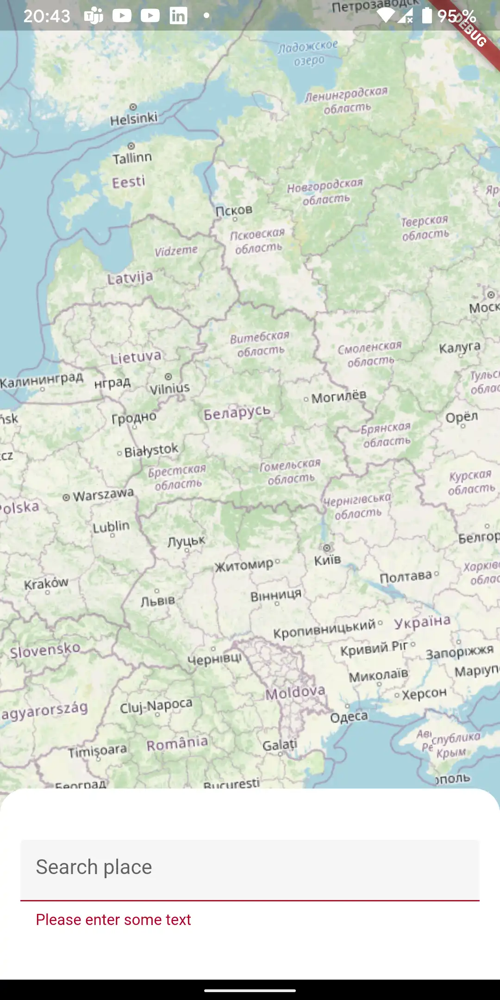
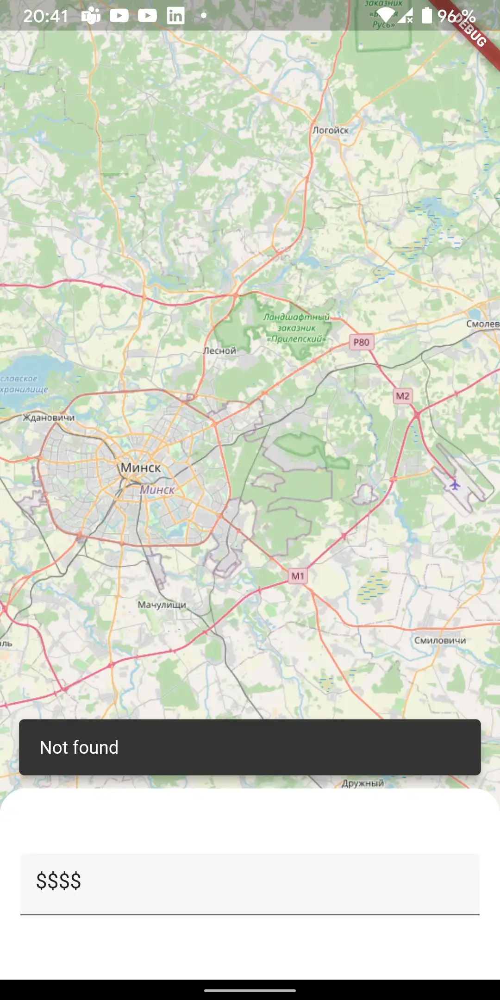
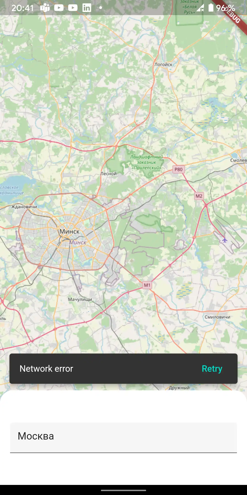
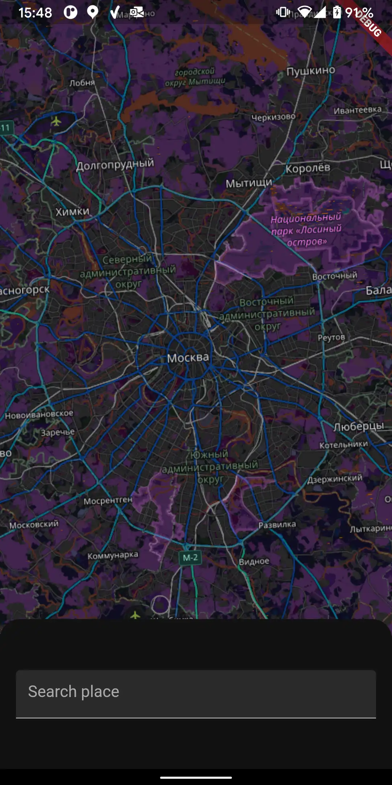

# Flutter map example

Flutter app for finding places on the map

## Overview

The [flutter_map](https://pub.dev/packages/flutter_map) library was used to work with maps in flutter

A OpenStreetMap search [request](https://nominatim.org/release-docs/develop/api/Search/) used to look up a location

### Features
* Search for a place by name or part of it
* Displaying found places on the map
* Saving the last found location after exiting the application
* Clearing the found place when moving the map

### Edge cases
* Input field validation(empty check)
* Show a error message if the search request was failed
* Show a message if the search didn't find anything

### Preview

